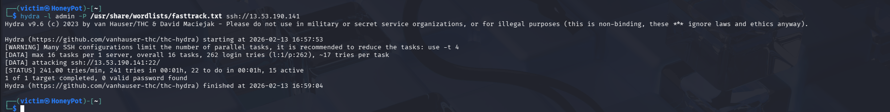
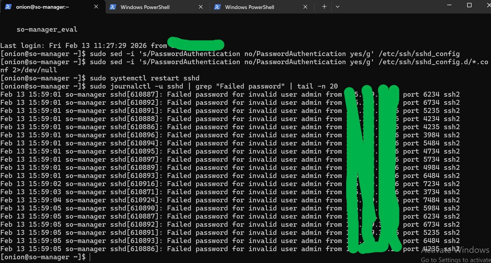
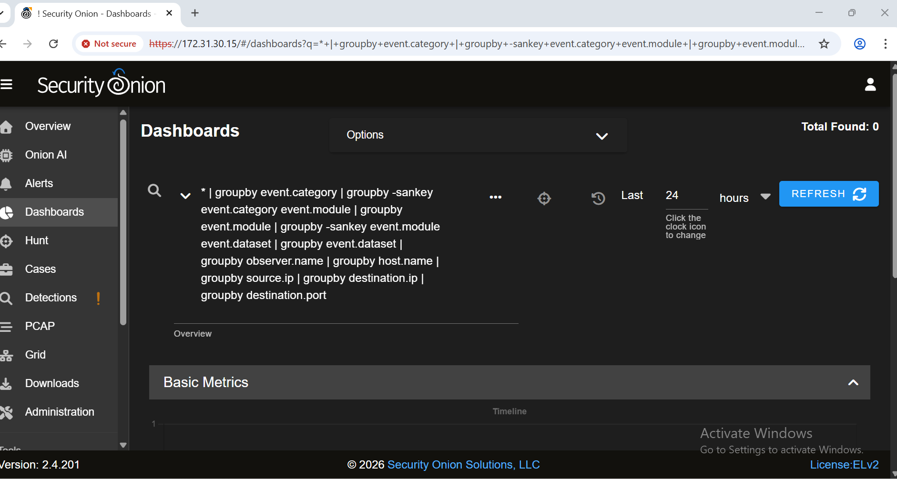

# 🛡️ Cloud SIEM Deployment & Red Team Attack Simulation

## 📝 Objective
This project demonstrates the deployment of a cloud-based Security Information and Event Management (SIEM) system and the execution of a simulated Red Team brute-force attack. The primary goal was to validate the SIEM's ingestion and detection capabilities by performing system-level forensic analysis on the resulting authentication logs.

## 🛠️ Tools & Environment
* **Cloud Infrastructure:** Amazon Web Services (AWS EC2)
* **SIEM:** Security Onion
* **Attacker Machine:** Kali Linux (VirtualBox VM)
* **Offensive Tools:** THC-Hydra
* **Protocols Analyzed:** SSH (Port 22)

## ⚔️ The Attack (Red Team Simulation)
To simulate a real-world threat actor, an automated dictionary attack was launched against the public-facing IP of the Security Onion Manager instance. The attack utilized `THC-Hydra` and the `fasttrack.txt` wordlist to systematically guess the password for the default `admin` account.

**Execution Command:**
```bash
hydra -l admin -P /usr/share/wordlists/fasttrack.txt ssh://<TARGET_IP>

```

**

## 🛡️ Detection & Analysis (Blue Team Forensics)

While web-based SIEM dashboards are excellent for high-level monitoring, cloud ingestion delays required immediate, system-level incident verification. Bypassing the web interface, direct forensic queries were executed against the core SSH daemon logs using `journalctl`.

**Forensic Query:**

```bash
sudo journalctl -u sshd | grep "Failed password" | tail -n 20

```

**Findings:**
The system logs revealed a rapid succession of `Failed password` entries originating from a single external IP address (`105.119.37.26`), targeting the `admin` user at a velocity of multiple attempts per second. This confirmed the automated nature of the brute-force attack.

**

## 💡 Remediation & Mitigation

To secure the environment against similar real-world automated attacks, the following Defense-in-Depth strategies must be applied:

1. **Enforce PKI Authentication:** Modify the `/etc/ssh/sshd_config` file to set `PasswordAuthentication no`. Enforcing cryptographic keys (`.pem` or `.pub`) completely neutralizes password-spraying and brute-force tools.
2. **Implement Rate Limiting:** Deploy an Intrusion Prevention System (IPS) like Suricata or a tool like Fail2Ban to automatically blackhole IP addresses that generate excessive authentication failures within a 60-second window.
3. **Change Default Ports:** Obfuscate the SSH service by moving it from Port 22 to a non-standard high port to reduce noise from automated internet scanners.

   ## 📊 SIEM Dashboard Visualization
The Security Onion web interface was utilized to monitor network traffic and hunt for the brute-force artifacts.


